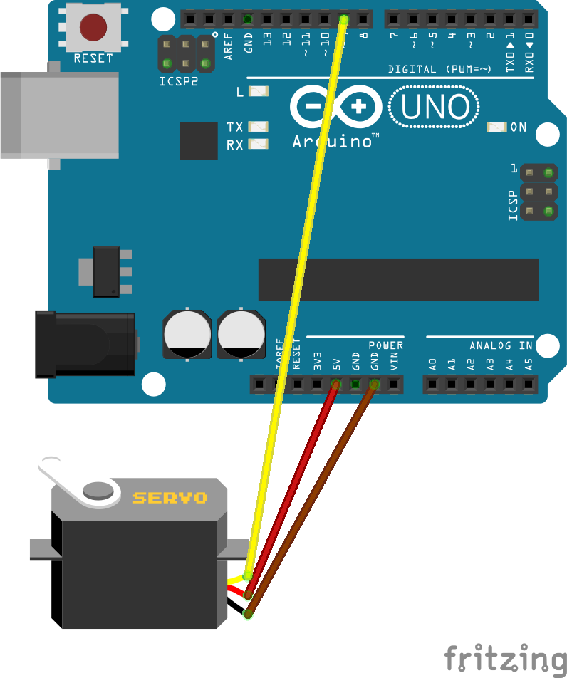

# 🤖 Arduino Basics: Making an SG90 Servo Motor Move

*A project so simple a 10‑year‑old can build it — and understand every piece.*

You will turn an **SG90 micro servo motor** and an **Arduino Uno** into a precise, moving machine.  
No extra power supply, no soldering — just three wires and curiosity.

---

## 🧠 What is a servo motor?

A servo is a smart motor. You don't just turn it on and let it spin. You tell it: *"Go to 45 degrees. Now go to 90 degrees. Now wave."* And it holds that position.

The SG90 is tiny but strong. It can swing from **0° to 180°** and stay exactly where you put it.  
This is the same kind of motor inside robot arms, camera sliders, and remote‑control planes.

**The three wires on the servo:**
- **Brown** – Ground. It completes the circuit.
- **Red** – Power. It drinks from the Arduino's 5V.
- **Orange** – Signal. It listens for position commands.

---

## 📚 Learning Path (Where This Fits)

This tutorial is step one. Here's the bigger picture:

1. **This tutorial** — Make the servo sweep (you are here)
2. **Control the servo with a potentiometer** — Turn a knob, the servo follows (coming soon)
3. **Control the servo with a joystick** — Thumb control like a video game (coming soon)
4. **Ultrasonic sensor + servo** — A motion‑activated tracker (coming soon)
5. **Pan‑tilt camera mount** — Two servos, full movement (coming soon)
6. **Robot arm** — Putting it all together (future)

Nobody builds a robot in a day. We build it one module at a time, and every module makes sense before the next one arrives.

---

## 🧱 What you need

| Component          | Quantity |
|--------------------|----------|
| Arduino Uno R3     | 1        |
| SG90 micro servo   | 1        |
| Breadboard         | 1        |
| Jumper wires (male‑to‑male) | 3 |

**No soldering. No extra power.**

---

## 📋 Component Details (Specs That Actually Matter)

| Spec | Value | Why It Matters |
|------|-------|----------------|
| SG90 operating voltage | 4.8V – 6V | Arduino's 5V pin is perfect |
| SG90 stall current | ~360mA at 4.8V | If the servo jams or pushes too hard, it pulls this much |
| Arduino Uno 5V pin max | ~400mA | Close! One unloaded SG90 is usually fine |
| USB port typical output | 500mA | The Arduino + one servo both drink from this |

**What this means in plain English:**  
An unloaded SG90 sweeping freely on USB power is safe. But if you add more servos, or if the servo is pushing against something heavy (stalling), it can pull more current than the Arduino's 5V pin or USB port can comfortably give. That's when you need an external power supply. For this tutorial — sweeping with no load — you're good.

---

## ⚡ Wiring (text diagram)
GND ------------ Brown wire
5V ------------ Red wire
D9 ------------ Orange wire

That's three wires. The servo gets its power straight from the Arduino's 5V pin.

---

### 🔌 Circuit Diagram

The three connections:
- **Brown** → GND
- **Red** → 5V
- **Orange** → Pin 9
---

## 💻 The Code

The full sketch is in the file **`sweep_servo.ino`** in this repository.  
Open it in the Arduino IDE, select your board and port, and click **Upload**.

Then open the **Serial Monitor** (Tools → Serial Monitor, set baud to `9600`).  
You'll see:
ervo ready! Watch it sweep.
Moving to: 0
Moving to: 1
...
Moving to: 180
Moving to: 179
...

The servo horn will smoothly turn from 0° to 180° and back, forever.

---

## 🔬 How the code works (explained for a 10‑year‑old)

1. **`#include <Servo.h>`** — This brings in a helper library that already knows how to talk to servos. It comes with the Arduino IDE, so you don't need to download anything.

2. **`Servo myServo;`** — You create a "driver" called `myServo`. Think of it like giving a name to your remote control.

3. **`myServo.attach(9);`** — You plug that remote into pin 9. Now whatever you tell `myServo` goes to the orange wire.

4. **`myServo.write(angle);`** — The actual command. "Go to this angle and stay there." Inside a `for` loop, `angle` counts from 0 to 180, so the servo moves step by step.

5. **`delay(15);`** — A tiny pause. The servo is fast, but not instant. It needs about 15 milliseconds to physically reach the next angle. Without this delay, it skips and twitches.

6. **Then it sweeps back.** The second `for` loop counts down from 180 to 0, and the servo reverses its journey.

That's the whole magic. No sensors, no cloud — just timing and tiny electric pulses.

---

## ⚡ How the Servo Knows Where to Go (PWM Explained Simply)

The Arduino doesn't speak "degrees." It speaks in **pulses** — tiny bursts of electricity.

Here's the secret language:

- The Arduino sends a pulse **50 times per second** (that's 50Hz).
- Each pulse can be **between 1 and 2 milliseconds** long.
- **A 1ms pulse means "go to 0 degrees."**
- **A 1.5ms pulse means "go to 90 degrees" (the middle).**
- **A 2ms pulse means "go to 180 degrees."**

So when the code says `myServo.write(90)`, it's really saying:  
*"Send a 1.5-millisecond pulse, 50 times per second."*

The servo has tiny electronics inside that measure the pulse length and move the motor until the output shaft matches. It's like a secret handshake: the length of the handshake tells the servo exactly where to point.

This technique is called **PWM (Pulse Width Modulation)** — a fancy name for "blinking electricity on and off really fast with different on‑times." The servo library handles all the math, so you just say an angle and it works.

---

## 🧪 Try these experiments

- **Change the sweep speed.** Make the delay `5` or `50`. What happens? *Too fast and the servo gets jerky; too slow and it crawls.*
- **Make it wave.** Instead of 0–180, sweep from 45 to 135. Now it looks like it's waving hello.
- **Change the pin.** Move the orange wire to pin 10, change `attach(9)` to `attach(10)` in the code. Does it still work? *(Spoiler: yes — pins 3, 5, 6, 9, 10, 11 are all servo‑ready.)*

---

## 🛠 Troubleshooting

- **Servo buzzes or vibrates but doesn't move.**  
  The USB port may not be giving enough current. Try a powered USB hub, or check that the red wire is firmly in the 5V pin.

- **Servo moves erratically or not at all.**  
  Check the orange wire is on pin 9. If you moved it, open `sweep_servo.ino` and change `attach(9)` to your new pin.

- **Servo gets hot.**  
  It's stalling — something is physically blocking it, or the angle is beyond its range. SG90 usually does 0–180, but some copies stop at 10–170. Stay inside those limits.

- **Nothing happens, and the Serial Monitor is blank.**  
  Make sure the baud rate in the monitor is set to 9600. Also check that your USB cable is data‑capable (some are charge‑only).

---

## 🔜 Next Steps

Now that you can make a servo move to exact angles, imagine controlling it with a joystick or an ultrasonic sensor. That's exactly where we're going next.  
👉 **Next tutorial:** Controlling a servo with a KY-023 joystick module — coming soon.

---

## 🤝 Why this project exists

I'm Parham. I'm 15 and I live in Iran. I built this because the first step into robotics should be so clear that nobody feels stupid.  
If you are a kid who just got their first Arduino, this is for you.  
If you are an adult who was always afraid of wires, this is for you too.

**Knowledge shouldn't be locked behind paywalls or import sanctions. Servos are just tiny muscles waiting for instructions.**

---

## 📄 License

MIT — use this however you like, just keep it open.

---

## 📬 Contact

inquiline.dev@proton.me
